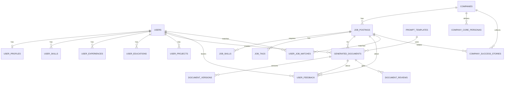

## FitCV 데이터베이스 스키마 및 ERD

- DB: PostgreSQL
- 작성일: 2025-09-13
- 작성자: 윤은
- 확장(extensions): `uuid-ossp`, `pg_trgm`

### 개요
FitCV는 사용자 프로필과 채용 공고를 매칭하여 자소서/포트폴리오/이력서를 생성합니다. 아래 ERD는 핵심 엔티티와 관계를 요약합니다.

### ERD (Mermaid)


### 핵심 엔티티 요약
- 사용자: `users`, `user_profiles`, `user_skills`, `user_experiences`, `user_educations`, `user_projects`
- 회사/채용: `companies`, `job_postings`, `job_skills`, `job_tags`
- 매칭: `user_job_matches`
- 생성/템플릿/버전: `prompt_templates`, `generated_documents`, `document_versions`
- 피드백/리뷰: `user_feedback`, `document_reviews`
- 시스템: `api_call_logs`, `job_queue`, `user_sessions`, `uploaded_files`
- 회사 인사이트: `company_core_personas`, `company_success_stories`

### 회사 인사이트 테이블 (추가)
- company_core_personas
  - 목적: 회사 핵심 인재상 집계/큐레이션 버전 저장
  - 주요 컬럼: `company_id`, `title`, `summary`, `attributes JSONB`, `keywords TEXT[]`, `source_type`, `source_refs JSONB`, `confidence_score`, `language`, `version`, `is_active`, `created_by`, `created_at`, `updated_at`
  - 인덱스: `(company_id, is_active)`, FTS on `title+summary`
- company_success_stories
  - 목적: 웹 스크래핑된 합격자 후기/인터뷰 경험 저장
  - 주요 컬럼: `company_id`, `job_posting_id`, `source_name`, `source_url(UNIQUE per company)`, `author_*`, `posted_at`, `title`, `content`, `content_html`, `language`, `sentiment`, `rating`, `keywords TEXT[]`, `categories TEXT[]`, `metrics JSONB`, `extraction_metadata JSONB`, `is_public`, `created_at`
  - 인덱스: `(company_id, posted_at DESC)`, FTS on `title+content`

#### 참고 DDL (발췌)
```sql
-- 회사 핵심 인재상 (집계/큐레이션된 버전)
CREATE TABLE company_core_personas (
    id SERIAL PRIMARY KEY,
    company_id INTEGER REFERENCES companies(id) ON DELETE CASCADE,
    title VARCHAR(200) NOT NULL,
    summary TEXT NOT NULL,
    attributes JSONB,
    keywords TEXT[],
    source_type VARCHAR(50) DEFAULT 'aggregated',
    source_refs JSONB,
    confidence_score DECIMAL(3,2),
    language VARCHAR(10),
    version VARCHAR(20) DEFAULT '1.0',
    is_active BOOLEAN DEFAULT true,
    created_by INTEGER REFERENCES users(id),
    created_at TIMESTAMP DEFAULT CURRENT_TIMESTAMP,
    updated_at TIMESTAMP DEFAULT CURRENT_TIMESTAMP
);

-- 합격자 후기 / 인터뷰 경험 등 외부 컨텐츠(스크래핑)
CREATE TABLE company_success_stories (
    id SERIAL PRIMARY KEY,
    company_id INTEGER REFERENCES companies(id) ON DELETE CASCADE,
    job_posting_id INTEGER REFERENCES job_postings(id),
    source_name VARCHAR(100),
    source_url TEXT NOT NULL,
    author_name VARCHAR(200),
    author_profile_url TEXT,
    posted_at TIMESTAMP,
    title VARCHAR(300),
    content TEXT,
    content_html TEXT,
    language VARCHAR(10),
    sentiment VARCHAR(20),
    rating INTEGER,
    keywords TEXT[],
    categories TEXT[],
    metrics JSONB,
    extraction_metadata JSONB,
    is_public BOOLEAN DEFAULT true,
    created_at TIMESTAMP DEFAULT CURRENT_TIMESTAMP,
    UNIQUE(company_id, source_url)
);

-- 인덱스
CREATE INDEX idx_company_core_personas_company ON company_core_personas(company_id, is_active);
CREATE INDEX idx_company_core_personas_fulltext ON company_core_personas USING GIN(
  to_tsvector('korean', coalesce(title,'') || ' ' || coalesce(summary,''))
);
CREATE INDEX idx_success_stories_company_date ON company_success_stories(company_id, posted_at DESC);
CREATE INDEX idx_success_stories_fulltext ON company_success_stories USING GIN(
  to_tsvector('korean', coalesce(title,'') || ' ' || coalesce(content,''))
);
```

### 인덱스/검색
- 기본 인덱스: `users(email)`, `users(is_active, created_at DESC)` 등
- 채용공고: 활성/지역/소스/회사, FTS(`title+description`), trigram(`title`)
- 매칭: 사용자/공고별 점수/북마크
- 사용자 프로필: 스킬/경력/프로젝트의 최신 정렬
- 문서: `generated_documents(user_id|job_posting_id, created_at)` / `document_versions(document_id, version_number)`
- 시스템: `api_call_logs(service_name|user_id, created_at)`, 작업 큐 상태/우선순위

### 트리거/뷰
- 트리거: `update_updated_at_column`로 `users`, `user_profiles`, `companies`, `job_postings`, `generated_documents`의 `updated_at` 자동 갱신
- 뷰: `user_complete_profiles`, `active_job_postings_detail`

### 적용 방법
- 스키마: `FitCV/infra/db/schema.sql`
- 적용 예시:
```bash
psql "postgresql://<USER>:<PASSWORD>@<HOST>:<PORT>/<DB_NAME>" -f FitCV/infra/db/schema.sql
```
